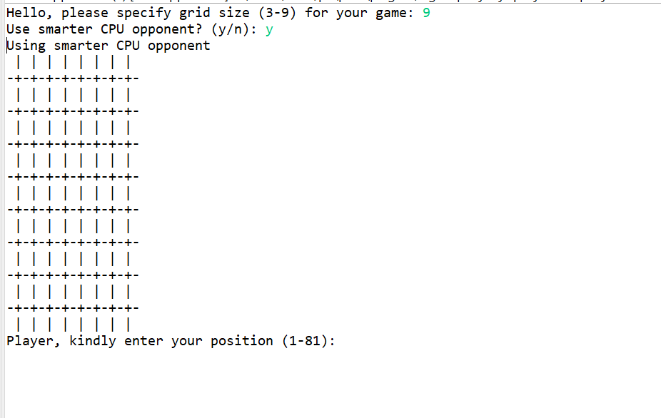

# tic-tac-toe-game
 
A command line selectable grid (up to 9x9) tic tac toe game written in Java that demonstrated the benefit of object-oriented design

<b>Enhancements made on top of original specifications</b>
1) User can choose the gridsize from 3x3 to 9x9.

2) Objected-oriented design was applied that seperate the main flow and the related classes - TicTacToe, CPUOpponent, SmarterCPUOpponent. It enabled program to update to future GUI easily as the design is modular.

3) A simple demostation of polymorphism. CPUOpponent will determine the next move against player with its nextMove() method. CPUOpponent implemented a simple nextMove() method that selects a random spot left on game grid. SmarterCPUOpponent extends CPUOpponent and overides the nextMove() method which selects an available winning move to CPU, or block any available winning move to player, and if both not available, selects a random spot. Say in the future an even smarter CPUOpponent is created, the change is easy

